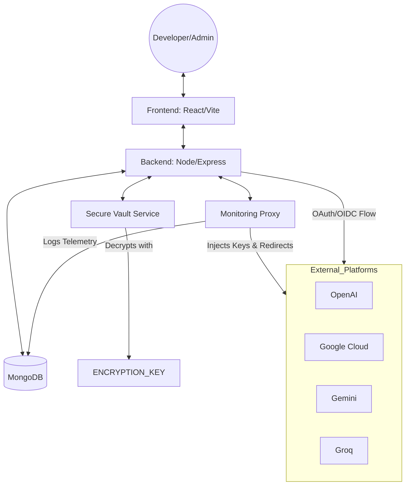

# SecureKey V2: Multi-Platform Architecture

SecureKey V2 extends the original platform into a multi-cloud API management hub. This document outlines the refined architecture and data flows.

## 🏗 System Architecture Diagram

## 🔐 Data Flow & Security

### 1. Key Vaulting Strategy
When a user adds an external API key (e.g., from OpenAI):
1.  **Ingestion**: Frontend receives the key and sends it via HTTPS to the `/api/external-providers/add` endpoint.
2.  **Encryption**: The `VaultService` uses **AES-256-GCM** to encrypt the key, generating an `iv` and `authTag`.
3.  **Storage**: Only the **Encrypted String** and a **Masked Preview** (e.g., `sk-...4421`) are stored in MongoDB.
4.  **Decryption**: Keys are ONLY decrypted in memory when a user initiates a proxy request to the external provider. They are never sent back to the frontend in raw form.

### 2. Multi-Platform Monitoring (Proxy Flow)
To monitor usage without forcing users to use local SDKs:
1.  Developer sends a request to our **Monitoring Bridge** (`/api/external-usage/proxy/:id`).
2.  The Bridge retrieves the decrypted key from the Vault.
3.  The Bridge makes a **Fetch** call to the external platform (OpenAI/Google).
4.  **Telemetry Data** (Response time, status code, endpoint) is recorded in `UsageLogs`.
5.  The platform response is returned to the Developer.

### 3. Anomaly & Threat Detection
A background **Scheduler** runs every 24 hours to scan the system for:
-   **Volumetric Spikes**: High request volumes that suggest key compromise.
-   **High Error Rates**: Elevated 4xx/5xx responses indicating improper configuration or abuse.
-   **Rotation Drifts**: Keys nearing expiration or those that haven't been rotated in >90 days.

## 🗄 Updated Database Schemas

### ExternalCredential
| Field | Purpose |
| :--- | :--- |
| `apiKeyEncrypted` | Store encrypted AES payload |
| `apiKeyMasked` | Searchable/Displayable identifier |
| `usageCount` | Total telemetry hits |
| `rateLimits` | Enforced quotas |

### ProviderAccount
| Field | Purpose |
| :--- | :--- |
| `externalAccountId` | Link to Google/OpenAI Identity |
| `permissions` | Scoped access (Read/Write/Usage) |

---
*SecureKey V2 - Built for Distributed Cloud Security.*
