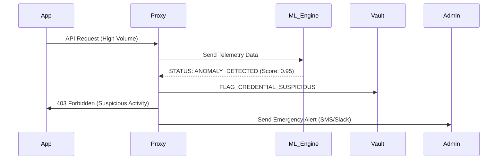

# 🛡️ SecureKey: Next-Generation API Security Architecture (Blueprint V3.0 - V5.0)

SecureKey is transitioning from a "Secure Vault" to an **"Active API Intelligence & Security Gateway."** This document outlines the roadmap to make SecureKey a market-ready platform that surpasses existing solutions like HashiCorp Vault and AWS Secrets Manager.

---

## 1. 🦄 Unique Differentiators (Strategic Edge)
Unlike static secret managers, SecureKey focuses on **Runtime Intelligence**:
*   **Active Intermediation**: SecureKey doesn't just store keys; it *is* the medium through which the API is called. This prevents "Client-Side Leakage" entirely.
*   **Zero-Knowledge SDKs**: Developers only ever handle an "Ephemeral Token" or a "Proxy URL," never the actual raw secret (OpenAI Key, AWS Secret).
*   **Behavioral Enforcement**: While AWS Secrets Manager stores a key, SecureKey *monitors its usage patterns* in real-time and kills the session if it detects non-human behavior.

---

## 2. 🛡️ Advanced Security "Add-Ons"
*   **Behavioral Fingerprinting**: Creating a "fingerprint" of the authorized application based on User-Agent, IP velocity, and typical Request Payload size.
*   **Adaptive Rate Limiting**: Instead of static limits (e.g., 100 req/min), limits shrink automatically if the user's "Security Score" drops or if global credential abuse is detected.
*   **Token Leak "Kill-Switch"**: Active monitoring of public social media and GitHub. If a key hash is detected, SecureKey performs a JIT (Just-In-Time) revocation.
*   **Zero-Trust API Gateway**: Every request must prove identity via mTLS or ephemeral JWTs injected by SecureKey's internal authentication service.

---

## 3. 🏗️ High-Scale Backend Modules
*   **Distributed Edge Proxies**: Using Golang-based sidecars deployed to Edge (Vercel/Cloudflare) to minimize proxy latency to <5ms.
*   **Event Streaming (Kafka/RabbitMQ)**: Offloading telemetry and audit logs to an "Analytics Pipeline" so the main Proxy Bridge remains non-blocking.
*   **Redis Multi-Layer Cache**:
    - *L1*: Ephemeral decrypted keys (TTL 60s).
    - *L2*: Rate limit counters (Atomic increments).
*   **Microservice Decomposition**:
    - `Cryptosvc`: (Rust/Go) Handles encryption/decryption only.
    - `Proxysvc`: Handles high-volume traffic forwarding.
    - `Authsvc`: Handles OIDC and Identity management.

---

## 4. 📊 Next-Gen Dashboard Components
*   **Live Attack Surface Monitoring**: A real-time graph showing blocked IPs, failed auth attempts, and geographic "hotspots" of suspicious activity.
*   **Credential Risk Scoring**: A dynamic grade (A-F) for each key based on its age, rotation frequency, and access granularity.
*   **Anomaly Prediction Forecast**: Uses ML to show predicted usage vs. actual usage, highlighting deviations in red.
*   **Provider Cost Attribution**: Real-time USD spend tracking across OpenAI, AWS, and GCP in one unified pie chart.

---

## 5. 🤖 Machine Learning for API Security
We propose the use of these specific models to detect anomalies:
1.  **Isolation Forest (Outlier Detection)**: Identifies rogue requests that don't fit the typical payload size or frequency profile.
2.  **LSTM (Long Short-Term Memory)**: Predicts the "Next Hour Request Count." Significant variance triggers an alert for a "Volumetric DDoS" or "Scraping Attempt."
3.  **One-Class SVM**: Learns the boundary of "Normal Developer Behavior" and flags anything outside that boundary as potentially compromised.

---

## ⚖️ Competitive Analysis: The "Gap" we Fill

| Feature | HashiCorp Vault | AWS Secrets Manager | Postman | **SecureKey (Next-Gen)** |
| :--- | :--- | :--- | :--- | :--- |
| **Philosophy** | Static Storage | Infrastructure Secret | Dev Productivity | **Active Defense & Observability** |
| **Runtime Proxy** | No | No | No | **Yes (Core Feature)** |
| **ML Anomaly Detection** | No | Limited (CloudWatch) | No | **Yes (Predictive)** |
| **Leak Scanning** | Optional (Plugins) | No | No | **Yes (Native)** |
| **Latency Tracking** | No | No | Manual only | **Yes (Automatic)** |

---

## 🏗️ Updated System Design (UML & Flow)

### Use Case Diagram
*   **Developer**: Register Credential, Fetch Proxy URL, View Analytics.
*   **Admin**: Manage Roles, Set Global Security Policies, Investigate Anomalies.
*   **System Engine**: Encrypt/Decrypt, Forward Requests, Detect Threats.

### Activity Diagram: Secure Proxy Chain
1. `Receive Request` -> 2. `Validate Auth Token` -> 3. `Check Rate Limit (Redis)` -> 4. `Fetch & Decrypt Key (Vault)` -> 5. `Forward to Provider` -> 6. `Log Telemetry (Async)` -> 7. `Return Response`.

### Sequence Diagram: Anomaly Response

---

## 📂 New Database Collections (V4.0)
*   `access_fingerprints`: Stores hardware/software signatures of authorized clients.
*   `ml_anomaly_logs`: Stores historical deviations for model training.
*   `cost_policies`: Mapping of API tiers to billing alerts.
*   `rotation_schedules`: Config for automated JIT key regeneration.

---

## 🚀 Future Roadmap (V3.0 - V5.0)

### V3.0: Intelligence Phase
- Integration of the ML Anomaly Engine.
- Real-time Cost tracking for major cloud providers.
- Automated Slack/Discord incident notifications.

### V4.0: Platform Phase
- **Multi-Region Cluster**: High availability across US, EU, and Asia.
- **Sidecar SDKs**: Release of official SecureKey sidecars for Kubernetes.
- **Postman Plugin**: Allowing developers to use SecureKey secrets directly in Postman without exposing them.

### V5.0: Ecosystem Phase (The SaaS Target)
- **Marketplace**: Third-party security plugins (e.g., Snyk integration).
- **Insurance-Backed Vault**: Partnering with cyber-insurance providers for guaranteed breach protection.
- **Universal Identity**: A single "SecureKey Passport" to manage every API you own across the internet.

---
**SecureKey** - *Decoupling Secrets from Software. Coupling Security with Observability.*
