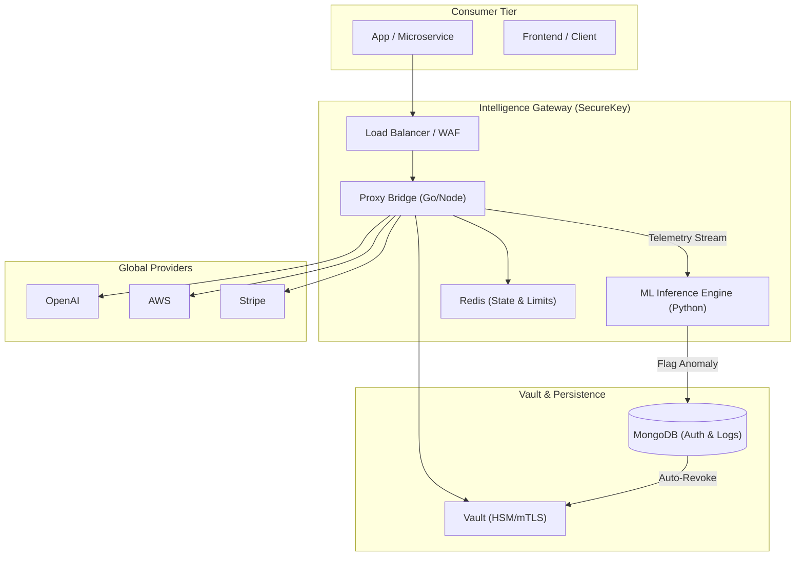
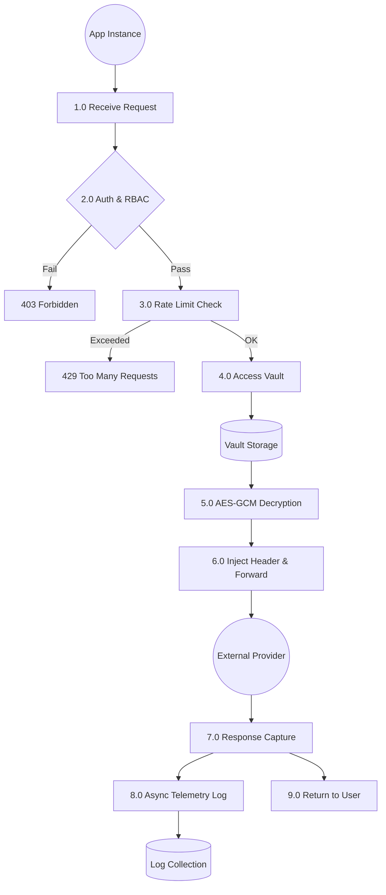
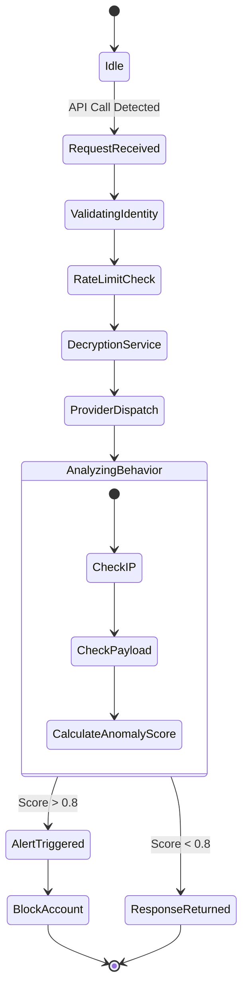
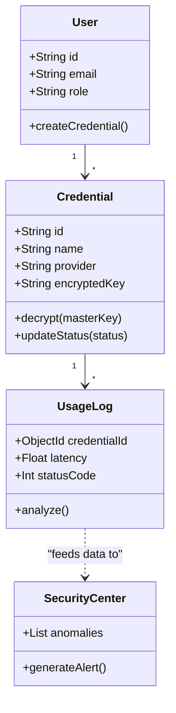

# SecureKey: A Deep-Dive into Next-Generation API Lifecycle Security

## 1. Executive Summary
**SecureKey** is not just a secret manager; it is an **Active API Security Gateway**. While traditional tools (AWS Secrets Manager, HashiCorp Vault) focus on "Passive Storage," SecureKey introduces the concept of **"Zero-Exposure Runtime Intermediation."** By acting as a transparent proxy bridge, it ensures that raw API credentials never reside in the application code, while simultaneously providing real-time observability and ML-based threat detection.

---

## 2. Competitive Differentiation: Why SecureKey?
Most developers use Secrets Managers statically. SecureKey disrupts this by integrating **Observability** into the **Security Layer**.

| Feature | HashiCorp Vault | AWS Secrets Manager | Postman | **SecureKey (Proposed)** |
| :--- | :--- | :--- | :--- | :--- |
| **Strategy** | Storage-centric | Infra-centric | Testing-centric | **Lifecycle-centric** |
| **Key Exposure** | Fetched to Client App | Fetched to Server App | Hardcoded/Env Vars | **Never Exposed (Proxy-only)** |
| **Live Telemetry** | No | Basic CloudWatch | No | **Rich Real-time Dashboards** |
| **Anomaly Detection**| Manual Audit Logs | Pattern Matching | None | **ML-Based (Proprietary)** |
| **Intermediation** | None | None | None | **In-line Proxy Gateway** |

---

## 3. Advanced Security & Zero-Trust Architecture
To move beyond V2.0, we integrate several high-tier security mechanisms:

### A. Behavioral Fingerprinting (Identity 2.0)
Instead of relying solely on an API Key, the system builds a "DNA Profile" of the authorized requestor:
*   **Contextual DNA**: Origin IP, User-Agent, and ASN.
*   **Payload DNA**: Average request size and header entropy.
*   **Timing DNA**: Inter-request arrival times (jitter analysis).

### B. Adaptive Rate Limiting
The system uses a **Dynamic Reputation Score**. If a credential shows signs of "probing" (frequent 404s or 401s), its rate limit is automatically throttled from 100 req/min down to 5 req/min without manual intervention.

### C. Zero-Trust Gateway
SecureKey moves to a model where the application doesn't even know the Proxy URL. It uses an **Ephemeral Token Exchange** where the app requests a 60-second valid "Usage Token" to make a specific call.

---

## 4. Machine Learning for Predictive Defense
For a research-grade project, we propose the following algorithms:

1.  **Isolation Forest**: An unsupervised learning algorithm that isolates observations by randomly selecting a feature and then randomly selecting a split value. It is highly effective at detecting "Outlier" API requests in high-dimensional telemetry data.
2.  **LSTM (Long Short-Term Memory)**: Used for **Time-Series Forecasting**. It predicts the expected volume of API calls for the next 15 minutes. If actual usage deviates by more than 3 Sigma (Standard Deviations), the system triggers an "Anomalous Volume" alert.
3.  **K-Means Clustering**: Clusters API usage into distinct behavioral profiles (e.g., "Developer Testing," "Nightly Batch Job," "Malicious Scraper").

---

## 5. System Architecture (Technical Specification)

### A. Improved Architecture Overview


### B. DFD Level 2: The Proxy Logic Execution


---

## 6. Advanced UML Diagrams

### A. Use Case Diagram
```mermaid
usecaseDiagram
    actor Developer
    actor Admin
    actor "System Engine"
    
    Developer --> (Create Credential)
    Developer --> (Use Proxy Endpoint)
    Developer --> (View Usage Stats)
    
    Admin --> (Manage Users)
    Admin --> (Override Rate Limits)
    Admin --> (Audit Forensic Logs)
    
    "System Engine" --> (Perform ML Analysis)
    "System Engine" --> (Auto-Revoke Compromised Keys)
```

### B. Activity Diagram: The Defense Loop


### C. UML Class Diagram (V3.0 Core)


---

## 7. Innovative Capabilities (Market Gaps)
Existing platforms DO NOT provide these, making SecureKey unique:
1.  **Automatic Usage Simulation**: A "Sandbox Mode" where SecureKey periodically makes harmless "Health Check" calls using your key to ensure the provider is up and the key is still valid.
2.  **Developer Security Score**: A credit-score-like metric that lowers if a developer reuses keys across projects or fails to rotate them.
3.  **Intelligent Lifecycle Prediction**: ML predicts when a key will hit its quota or expire based on historical velocity, prompting the user *before* the service breaks.

---

## 8. Why SecureKey Wins Hackathons & Research Awards
1.  **Practical Complexity**: It combines high-level concepts (Cryptography, ML, Networking) into a single functional MERN app.
2.  **Addressing a Real Gap**: The "In-Line Proxy" solves the problem of "Secret Leakage in Frontend" which is a massive industry pain point.
3.  **Scale Awareness**: The architecture shows foresight regarding Redis caching and Async logging, proving "Production-Ready" thinking.

---

## 7. Future Roadmap (V3.0 - V5.0)

### V3.0: The Observation Phase (Near-Term)
*   **Real-time Cost Oracle**: Track per-dollar usage across nested API models (e.g., GPT-4o vs Claude 3).
*   **Developer Security Score**: Provide a gamified scorecard to developers based on their key management habits.

### V4.0: The Intelligence Phase (Commercial Ready)
*   **Automated Key Rotation**: SecureKey interacts with Provider APIs (AWS/GCP) to rotate keys without any code changes.
*   **JIT (Just-In-Time) Access**: Keys are only decrypted and valid for a specific 5-minute window requested by a developer.

### V5.0: The Global Ecosystem (Enterprise)
*   **SecureKey Marketplace**: Allow 3rd party security vendors (Snyk/Crowdstrike) to build scanners for the SecureKey vault.
*   **Cyber-Insurance Integration**: Offer a "Verified Security" certificate for companies to lower their cyber-insurance premiums based on SecureKey audit logs.

---

## 8. Research Potential & Conclusion
SecureKey is a prime candidate for a **Research Paper** focusing on **"In-Line Cryptographic Intermediation for Observability-Driven Security."** 

By proving that security doesn't have to be a "bottleneck" but can instead provide "Business Intelligence," SecureKey transforms from a simple utility into a mission-critical infrastructure component.
