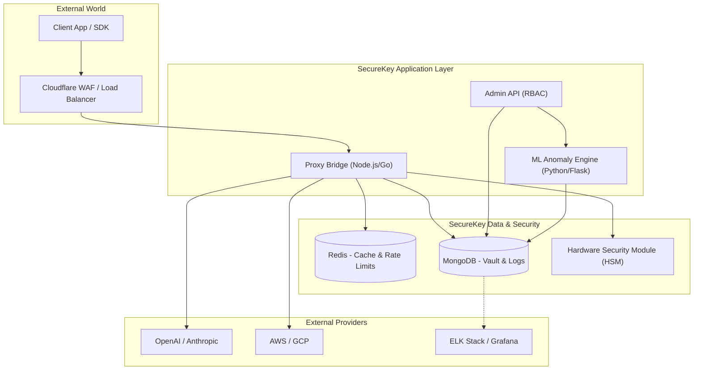
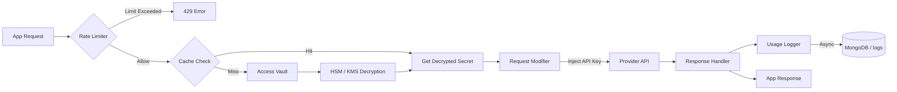
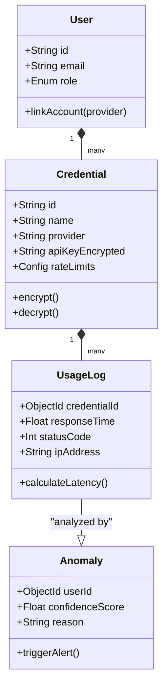
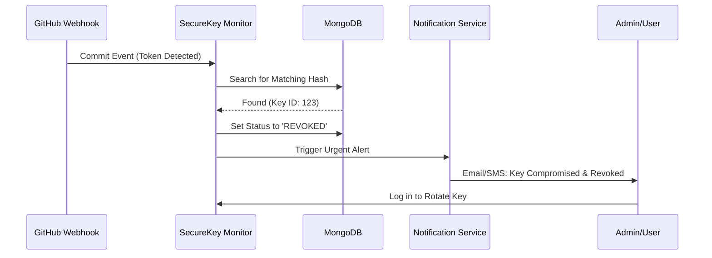

# SecureKey V3.0: Detailed System Design & Architecture

This document provides the technical diagrams and schema definitions required for high-level documentation and research papers.

---

## 1. System Architecture (Enterprise Layout)

The diagram below illustrates the proposed V3.0 architecture, transitioning to a high-availability, micro-services ready structure.



---

## 2. Data Flow Diagram (DFD Level 2: Proxy Request)

This DFD shows the granular flow of data during a "Secure Proxy Request".



---

## 3. UML Class Diagram (Updated)

Expanded classes to include ML Anomaly detection and Rate Limit configurations.



---

## 4. Sequence Diagram: Threat Detection Flow

How the system detects and reacts to a potential credential leak.



---

## 5. New Database Collections (V3.0 Schema)

To support advanced features, add these collections to your MongoDB:

### `anomalies`
```javascript
{
  userId: ObjectId,
  credentialId: ObjectId,
  severity: ["low", "medium", "critical"],
  score: 0.98, // ML Confidence
  patternDetected: "Geographic Jump",
  metadata: { prevIp: "1.1.1.1", newIp: "8.8.8.8" },
  createdAt: ISODate
}
```

### `ip_whitelists`
```javascript
{
  credentialId: ObjectId,
  allowedIps: [String],
  allowedDomains: [String],
  enforced: Boolean
}
```

### `cost_mapping`
```javascript
{
  provider: "openai",
  model: "gpt-4o",
  pricePer1kTokens: 0.005,
  currency: "USD"
}
```

---

## 6. Research Focus Suggestions
If using this for a **Research Paper**, focus on these specific sections:
1.  **Quantitative Analysis**: Compare latency overhead between a Direct Request vs. SecureKey Proxy Request (Goal: <50ms overhead).
2.  **Privacy Preservation**: Discuss why "Runtime Decryption" is superior to "Developer-side Decryption."
3.  **Machine Learning Accuracy**: Measure the False Positive Rate (FPR) of the Isolation Forest model in detecting unauthorized users.
